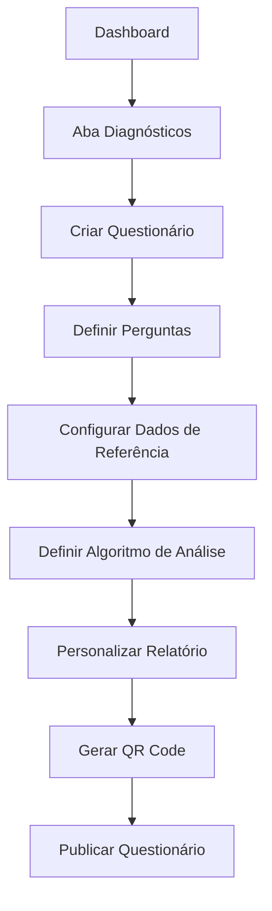
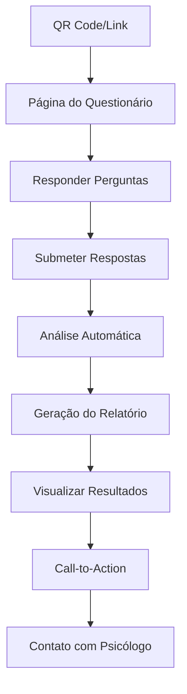
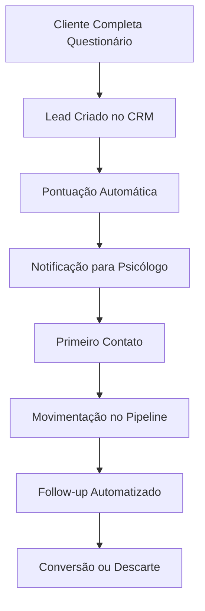

# Plano Estratégico: Sistema de Diagnóstico Automatizado e CRM Integrado

## 1. Visão Geral do Projeto

### 1.1 Conceito Central
Sistema inteligente de diagnóstico psicológico que permite aos consultores criar questionários personalizados, analisar automaticamente as respostas dos clientes contra dados de referência pré-cadastrados, e gerar relatórios de ROI para conversão de leads em clientes.

### 1.2 Objetivos Principais
- **Automatizar o processo de diagnóstico** inicial de clientes
- **Gerar leads qualificados** através de questionários públicos
- **Demonstrar valor tangível** com relatórios de ROI personalizados
- **Integrar funil de vendas** com sistema CRM nativo
- **Escalar atendimento** através de diagnósticos automatizados

### 1.3 Proposta de Valor
- **Para Psicólogos**: Ferramenta de captação e qualificação de leads com demonstração automática de ROI
- **Para Clientes**: Diagnóstico gratuito e insights sobre potencial de melhoria
- **Para o Negócio**: Diferencial competitivo único no mercado de psicologia

## 2. Análise de Necessidades e Mercado

### 2.1 Problemas Identificados
- **Captação de leads**: Dificuldade em atrair novos clientes
- **Qualificação manual**: Processo demorado de avaliação inicial
- **Demonstração de valor**: Dificuldade em mostrar ROI antes da contratação
- **Funil desorganizado**: Falta de sistema para gerenciar leads
- **Escalabilidade limitada**: Dependência de atendimento 1:1 para diagnósticos

### 2.2 Oportunidades de Mercado
- **Digitalização da psicologia**: Crescente demanda por soluções tech
- **Marketing de conteúdo**: Questionários como ferramenta de atração
- **Automação de vendas**: Redução do ciclo de vendas
- **Diferenciação competitiva**: Poucos concorrentes com esta funcionalidade

## 3. Arquitetura e Funcionalidades

### 3.1 Componentes Principais

#### 3.1.1 Dashboard do Consultor - Aba "Diagnósticos"
**Funcionalidades:**
- Criação e edição de questionários personalizados
- Configuração de dados de referência/comparativos
- Definição de algoritmos de análise
- Geração de QR codes para acesso público
- Visualização de estatísticas de uso
- Gerenciamento de templates de questionários

#### 3.1.2 Sistema de Questionários
**Tipos de Perguntas:**
- Múltipla escolha (com pontuação)
- Escala Likert (1-10)
- Texto livre (análise por palavras-chave)
- Seleção de imagens/cenários
- Perguntas condicionais (lógica de ramificação)

**Configurações:**
- Tempo limite para resposta
- Obrigatoriedade de perguntas
- Randomização de ordem
- Personalização visual (cores, logo)
- Mensagens de feedback personalizadas

#### 3.1.3 Engine de Análise Automatizada
**Algoritmos de Comparação:**
- Pontuação ponderada por categoria
- Análise de gaps (situação atual vs ideal)
- Cálculo de potencial de melhoria
- Identificação de áreas críticas
- Geração de insights personalizados

**Dados de Referência:**
- Benchmarks por faixa etária
- Padrões por área de atuação
- Métricas de sucesso histórico
- Correlações entre problemas e soluções

#### 3.1.4 Gerador de Relatórios de ROI
**Conteúdo do Relatório:**
- Situação atual do cliente (gráficos e métricas)
- Comparação com dados de referência
- Áreas de oportunidade identificadas
- Projeção de benefícios com consultoria
- Estimativa de ROI financeiro/pessoal
- Call-to-action personalizado

#### 3.1.5 Sistema CRM Integrado
**Funcionalidades:**
- Pipeline de vendas visual (Kanban)
- Histórico completo de interações
- Pontuação de leads (lead scoring)
- Automação de follow-up
- Integração com WhatsApp/Email
- Relatórios de conversão

### 3.2 Fluxos de Usuário

#### 3.2.1 Fluxo do Psicólogo (Configuração)


#### 3.2.2 Fluxo do Cliente (Diagnóstico)


#### 3.2.3 Fluxo do CRM (Gestão de Leads)


## 4. Estrutura Técnica

### 4.1 Arquitetura de Dados

#### 4.1.1 Entidades Principais
```typescript
interface Questionario {
  id: string;
  consultorId: string;
  nome: string;
  descricao: string;
  categoria: string;
  ativo: boolean;
  publico: boolean;
  qrCode: string;
  configuracoes: ConfiguracaoQuestionario;
  perguntas: Pergunta[];
  dadosReferencia: DadoReferencia[];
  algoritmoAnalise: AlgoritmoAnalise;
  templateRelatorio: TemplateRelatorio;
  estatisticas: EstatisticaUso;
  createdAt: Date;
  updatedAt: Date;
}

interface Pergunta {
  id: string;
  questionarioId: string;
  ordem: number;
  tipo: 'multipla_escolha' | 'escala' | 'texto' | 'imagem';
  titulo: string;
  descricao?: string;
  obrigatoria: boolean;
  opcoes?: OpcaoPergunta[];
  configuracoes: ConfiguracaoPergunta;
  categoria: string;
  peso: number;
}

interface RespostaQuestionario {
  id: string;
  questionarioId: string;
  clienteId?: string;
  respostas: RespostaPergunta[];
  analiseResultado: AnaliseResultado;
  relatorioGerado: RelatorioROI;
  status: 'completo' | 'incompleto' | 'expirado';
  tempoResposta: number;
  origem: 'qr_code' | 'link_direto' | 'assistido';
  createdAt: Date;
}

interface AnaliseResultado {
  pontuacaoTotal: number;
  pontuacaoPorCategoria: Record<string, number>;
  gaps: Gap[];
  insights: string[];
  recomendacoes: string[];
  potencialMelhoria: number;
  roiEstimado: ROIEstimado;
}

interface LeadCRM {
  id: string;
  consultorId: string;
  nome: string;
  email: string;
  telefone?: string;
  origem: 'questionario' | 'site' | 'indicacao';
  questionarioId?: string;
  pontuacao: number;
  status: 'novo' | 'contatado' | 'qualificado' | 'proposta' | 'fechado' | 'perdido';
  historico: InteracaoLead[];
  proximoFollowUp?: Date;
  observacoes: string;
  valorPotencial?: number;
  createdAt: Date;
  updatedAt: Date;
}
```

### 4.2 APIs Necessárias

#### 4.2.1 Questionários
```
GET /api/questionarios - Listar questionários do consultor
POST /api/questionarios - Criar novo questionário
PUT /api/questionarios/:id - Atualizar questionário
DELETE /api/questionarios/:id - Excluir questionário
GET /api/questionarios/:id/estatisticas - Estatísticas de uso
POST /api/questionarios/:id/duplicar - Duplicar questionário
```

#### 4.2.2 Respostas e Análise
```
GET /api/questionario/:slug - Questionário público para resposta
POST /api/questionario/:slug/responder - Submeter respostas
GET /api/respostas/:id/relatorio - Relatório de ROI gerado
GET /api/consultor/respostas - Listar respostas recebidas
```

#### 4.2.3 CRM
```
GET /api/crm/leads - Listar leads do consultor
PUT /api/crm/leads/:id - Atualizar status do lead
POST /api/crm/leads/:id/interacao - Registrar interação
GET /api/crm/pipeline - Dados do pipeline de vendas
GET /api/crm/relatorios - Relatórios de conversão
```

### 4.3 Componentes de Interface

#### 4.3.1 Dashboard - Aba Diagnósticos
- Lista de questionários criados
- Botão "Criar Novo Questionário"
- Estatísticas rápidas (respostas, conversões)
- Templates pré-definidos

#### 4.3.2 Editor de Questionários
- Interface drag-and-drop para perguntas
- Preview em tempo real
- Configurações avançadas
- Teste do questionário

#### 4.3.3 Dashboard CRM
- Pipeline visual (Kanban)
- Lista de leads com filtros
- Gráficos de conversão
- Agenda de follow-ups

#### 4.3.4 Página Pública do Questionário
- Design responsivo e profissional
- Barra de progresso
- Validação em tempo real
- Página de resultados

## 5. Roadmap de Implementação

### 5.1 Fase 1 - MVP (6-8 semanas)
**Prioridade: Alta**

#### Funcionalidades Básicas
- Criação de questionários simples (múltipla escolha + escala)
- Sistema básico de análise (pontuação simples)
- Geração de relatórios básicos
- CRM simples (lista de leads)
- Página pública para resposta

#### Entregáveis
- Aba "Diagnósticos" no dashboard
- Editor básico de questionários
- Engine de análise MVP
- Gerador de relatórios simples
- CRM básico integrado

### 5.2 Fase 2 - Funcionalidades Avançadas (4-5 semanas)
**Prioridade: Média-Alta**

#### Novas Funcionalidades
- Perguntas condicionais (lógica de ramificação)
- Algoritmos de análise avançados
- Templates de questionários
- Automação de follow-up
- Integração WhatsApp/Email

#### Melhorias
- Interface mais intuitiva
- Relatórios mais ricos
- Dashboard CRM avançado
- Analytics detalhados

### 5.3 Fase 3 - Inteligência e Automação (5-6 semanas)
**Prioridade: Média**

#### Funcionalidades Premium
- IA para análise de texto livre
- Recomendações automáticas
- A/B testing de questionários
- Integração com calendário
- API para integrações externas

#### Otimizações
- Performance e escalabilidade
- SEO para questionários públicos
- Mobile app (opcional)

### 5.4 Fase 4 - White-Label e Monetização (3-4 semanas)
**Prioridade: Baixa-Média**

#### Funcionalidades Empresariais
- Configurações white-label
- Planos diferenciados
- Relatórios consolidados
- API para parceiros

## 6. Estimativas de Recursos

### 6.1 Equipe Necessária
- **1 Tech Lead/Arquiteto** (definições técnicas e arquitetura)
- **2 Desenvolvedores Frontend** (React/TypeScript)
- **1 Desenvolvedor Backend** (APIs e banco de dados)
- **1 Designer UI/UX** (interfaces e experiência)
- **1 Product Owner** (definições e testes)
- **1 QA/Tester** (testes e qualidade)

### 6.2 Cronograma e Custos

#### Fase 1 (MVP) - 6-8 semanas
- **Desenvolvimento**: R$ 120.000 - R$ 160.000
- **Design**: R$ 25.000 - R$ 35.000
- **QA/Testes**: R$ 15.000 - R$ 20.000
- **Subtotal**: R$ 160.000 - R$ 215.000

#### Fase 2 (Avançado) - 4-5 semanas
- **Desenvolvimento**: R$ 80.000 - R$ 100.000
- **Design**: R$ 15.000 - R$ 20.000
- **QA/Testes**: R$ 10.000 - R$ 15.000
- **Subtotal**: R$ 105.000 - R$ 135.000

#### Fase 3 (IA/Automação) - 5-6 semanas
- **Desenvolvimento**: R$ 100.000 - R$ 120.000
- **IA/ML**: R$ 30.000 - R$ 40.000
- **QA/Testes**: R$ 15.000 - R$ 20.000
- **Subtotal**: R$ 145.000 - R$ 180.000

#### Fase 4 (White-label) - 3-4 semanas
- **Desenvolvimento**: R$ 60.000 - R$ 80.000
- **Infraestrutura**: R$ 10.000 - R$ 15.000
- **Subtotal**: R$ 70.000 - R$ 95.000

**TOTAL GERAL**: R$ 480.000 - R$ 625.000

### 6.3 Infraestrutura Adicional
- **Servidor de análise**: R$ 500-1.000/mês
- **CDN para questionários**: R$ 200-400/mês
- **Backup e segurança**: R$ 300-500/mês
- **Monitoramento**: R$ 200-300/mês

## 7. Projeção de ROI e Benefícios

### 7.1 Benefícios Quantitativos

#### Para Psicólogos
- **Aumento de leads**: 200-400% (questionários como ímã de leads)
- **Taxa de conversão**: 15-25% (leads pré-qualificados)
- **Redução tempo diagnóstico**: 70% (automatização)
- **Aumento ticket médio**: 30-50% (demonstração de valor)

#### Para a Plataforma
- **Diferenciação competitiva**: Funcionalidade única no mercado
- **Aumento retenção**: 40-60% (ferramenta de alto valor)
- **Novos usuários**: 25-35% (atração por funcionalidade)
- **Receita adicional**: R$ 50.000-80.000/mês (planos premium)

### 7.2 Projeção Financeira (12 meses)

#### Cenário Conservador
- **Usuários ativos**: 200 psicólogos
- **Questionários por mês**: 2.000
- **Taxa de conversão**: 15%
- **Receita adicional**: R$ 600.000/ano
- **Payback**: 12-15 meses

#### Cenário Otimista
- **Usuários ativos**: 500 psicólogos
- **Questionários por mês**: 8.000
- **Taxa de conversão**: 25%
- **Receita adicional**: R$ 1.500.000/ano
- **Payback**: 6-8 meses

### 7.3 Benefícios Qualitativos
- **Posicionamento como líder tecnológico**
- **Atração de psicólogos mais qualificados**
- **Dados valiosos sobre comportamento do mercado**
- **Base para futuras funcionalidades de IA**
- **Potencial de licenciamento da tecnologia**

## 8. Análise de Riscos

### 8.1 Riscos Técnicos

#### Alto Impacto
- **Complexidade da engine de análise**: Algoritmos podem não ser precisos
  - *Mitigação*: Começar simples, evoluir com feedback
- **Performance com muitos usuários**: Sistema pode ficar lento
  - *Mitigação*: Arquitetura escalável desde o início

#### Médio Impacto
- **Integração com sistema atual**: Pode quebrar funcionalidades
  - *Mitigação*: Desenvolvimento modular e testes extensivos
- **Segurança de dados**: Informações sensíveis dos clientes
  - *Mitigação*: LGPD compliance e criptografia

### 8.2 Riscos de Negócio

#### Alto Impacto
- **Baixa adoção**: Psicólogos podem não usar a funcionalidade
  - *Mitigação*: Pesquisa de mercado e MVP para validação
- **Regulamentação**: CFP pode restringir diagnósticos automatizados
  - *Mitigação*: Posicionar como "triagem" não "diagnóstico"

#### Médio Impacto
- **Concorrência**: Outros players podem copiar
  - *Mitigação*: Vantagem do primeiro movimento e evolução rápida
- **Qualidade dos insights**: Relatórios podem não agregar valor
  - *Mitigação*: Testes com usuários reais e iteração constante

### 8.3 Riscos Operacionais

#### Médio Impacto
- **Suporte ao cliente**: Aumento significativo de dúvidas
  - *Mitigação*: Documentação detalhada e tutoriais
- **Moderação de conteúdo**: Questionários inadequados
  - *Mitigação*: Sistema de aprovação e diretrizes claras

## 9. Métricas de Sucesso

### 9.1 Métricas de Adoção
- **Taxa de ativação**: % de consultores que criam questionários
- **Questionários criados por usuário**: Média mensal
- **Taxa de uso contínuo**: % que usa após 30 dias

### 9.2 Métricas de Engajamento
- **Respostas por questionário**: Média de participação
- **Taxa de conclusão**: % que completa o questionário
- **Tempo médio de resposta**: Usabilidade
- **NPS dos questionários**: Satisfação dos respondentes

### 9.3 Métricas de Conversão
- **Lead generation**: Número de leads gerados
- **Taxa de conversão lead→cliente**: % de fechamento
- **Tempo médio de conversão**: Eficiência do funil
- **Valor médio por lead**: ROI da funcionalidade

### 9.4 Métricas de Negócio
- **Receita adicional gerada**: Impacto financeiro direto
- **Retenção de usuários**: Impacto na churn rate
- **NPS geral da plataforma**: Satisfação global
- **Market share**: Posição competitiva

## 10. Considerações Éticas e Regulatórias

### 10.1 Compliance Profissional
- **Não substituir diagnóstico profissional**: Posicionar como triagem
- **Transparência nos algoritmos**: Explicar como funciona a análise
- **Responsabilidade profissional**: Psicólogo responsável pelos resultados
- **Sigilo profissional**: Garantir confidencialidade dos dados

### 10.2 LGPD e Privacidade
- **Consentimento explícito**: Para coleta e uso de dados
- **Direito ao esquecimento**: Permitir exclusão de dados
- **Portabilidade**: Exportação de dados pessoais
- **Minimização**: Coletar apenas dados necessários

### 10.3 Diretrizes de Uso
- **Templates aprovados**: Questionários pré-validados
- **Limitações claras**: O que o sistema pode/não pode fazer
- **Treinamento obrigatório**: Para uso da funcionalidade
- **Auditoria regular**: Revisão dos questionários criados

## 11. Conclusão e Recomendação

### 11.1 Análise de Viabilidade

#### Viabilidade Técnica: **ALTA**
- Tecnologias maduras e disponíveis
- Arquitetura escalável e modular
- Integração possível com sistema atual

#### Viabilidade Comercial: **MUITO ALTA**
- Demanda comprovada no mercado
- Diferencial competitivo significativo
- ROI atrativo em múltiplos cenários

#### Viabilidade Operacional: **ALTA**
- Equipe técnica capacitada
- Recursos financeiros disponíveis
- Cronograma realista

### 11.2 Impacto Estratégico

#### Benefícios Imediatos
- **Diferenciação no mercado**: Funcionalidade única
- **Aumento de valor percebido**: Ferramenta de alto impacto
- **Geração de receita**: Nova fonte de monetização

#### Benefícios de Longo Prazo
- **Liderança tecnológica**: Posicionamento como inovador
- **Dados estratégicos**: Insights sobre o mercado
- **Plataforma para IA**: Base para futuras evoluções

### 11.3 Recomendação Final

**IMPLEMENTAR COM PRIORIDADE ALTA**

Este projeto representa uma oportunidade única de:
1. **Criar diferenciação competitiva sustentável**
2. **Gerar valor significativo para usuários**
3. **Abrir nova fonte de receita**
4. **Posicionar a empresa como líder em inovação**

### 11.4 Próximos Passos Recomendados

#### Imediatos (1-2 semanas)
1. **Aprovação executiva** do projeto e orçamento
2. **Formação da equipe** de desenvolvimento
3. **Pesquisa detalhada** com 10-15 psicólogos usuários
4. **Prototipação rápida** das telas principais

#### Curto Prazo (2-4 semanas)
1. **Definição técnica detalhada** da arquitetura
2. **Design system** para as novas funcionalidades
3. **Setup do ambiente** de desenvolvimento
4. **Início do desenvolvimento** da Fase 1

#### Médio Prazo (2-3 meses)
1. **Lançamento do MVP** para usuários beta
2. **Coleta de feedback** e iterações
3. **Planejamento da Fase 2**
4. **Estratégia de marketing** para lançamento

---

*Este plano estratégico fornece a base completa para a tomada de decisão sobre a implementação do Sistema de Diagnóstico Automatizado e CRM Integrado no PsiColab.*